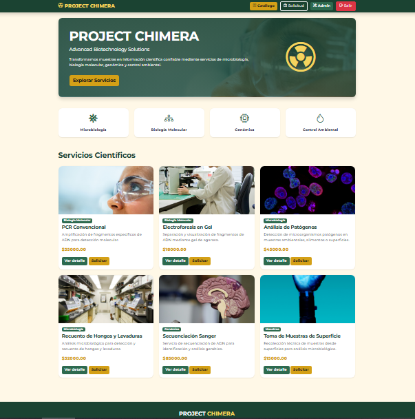
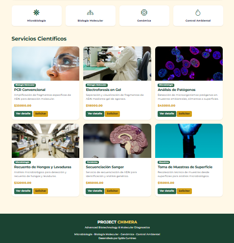
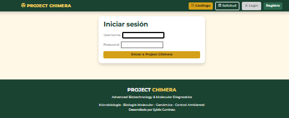
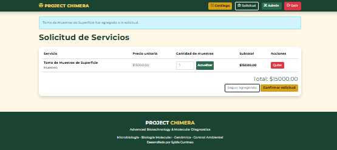
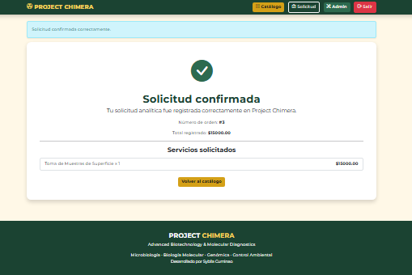
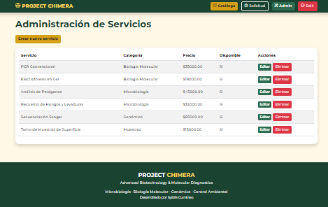

# 🧬 Project Chimera


Repositorio público: https://github.com/Sybilac/project-chimera

> **Advanced Biotechnology & Molecular Diagnostics**

Project Chimera es una aplicación web desarrollada con Django que simula una plataforma de gestión y solicitud de servicios biotecnológicos.

El proyecto fue desarrollado como portafolio final del curso de Desarrollo de Aplicaciones con Python y Django, integrando conocimientos de desarrollo web con una propuesta inspirada en el área de la biotecnología.

---

## Objetivos

El objetivo principal del proyecto es ofrecer una plataforma que permita administrar un catálogo de servicios biotecnológicos mediante una interfaz moderna e intuitiva.

Entre sus funcionalidades destacan:

* Gestión de servicios biotecnológicos.
* Administración mediante CRUD.
* Registro e inicio de sesión de usuarios.
* Carrito de solicitudes.
* Confirmación de órdenes.
* Panel administrativo.
* Gestión mediante Django ORM.
* Uso de Bootstrap para una interfaz responsiva.

---

## Tecnologías utilizadas

* Python
* Django
* SQLite
* HTML5
* CSS3
* Bootstrap 5
* Bootstrap Icons
* Google Fonts
* Git
* GitHub

---

## Funcionalidades

### Cliente

* Registro de usuario.
* Inicio de sesión.
* Visualización del catálogo.
* Agregar servicios al carrito.
* Actualizar cantidades.
* Eliminar servicios.
* Confirmar solicitudes.
* Registro de órdenes asociadas al usuario autenticado.

### Administrador

* Panel administrativo de Django.
* Gestión de categorías.
* Crear servicios.
* Editar servicios.
* Eliminar servicios.
* Administración completa del catálogo.

---

## Servicios disponibles

Project Chimera incorpora un catálogo orientado al área biotecnológica, incluyendo servicios como:

* PCR Convencional.
* Electroforesis en Gel.
* Secuenciación Sanger.
* Detección de Patógenos.
* Recuento de Hongos y Levaduras.
* Muestreo de Superficies.
* Control Microbiológico.
* Biología Molecular.
* Genómica.

---

## Motor de Base de Datos

Actualmente el proyecto utiliza SQLite para facilitar su instalación, ejecución local y evaluación.

La arquitectura fue diseñada para permitir una futura migración a PostgreSQL sin cambios importantes en la lógica del sistema gracias al uso del ORM de Django.

---

## Usuarios de prueba

### Administrador

- **Usuario:** admin
- **Contraseña:** La configurada al crear el superusuario.

### Cliente

- **Usuario:** cliente
- **Contraseña:** cliente1

---

## Instalación

Clonar el repositorio:

```bash
git clone https://github.com/Sybilac/project-chimera
```

Ingresar al proyecto:

```bash
cd project-chimera
```

Crear entorno virtual:

```bash
python -m venv env
```

Activar entorno virtual en Windows:

```bash
env\Scripts\activate
```

Instalar dependencias:

```bash
pip install -r requirements.txt
```

Aplicar migraciones:

```bash
python manage.py migrate
```

Ejecutar servidor:

```bash
python manage.py runserver
```

Abrir en el navegador:

```text
http://127.0.0.1:8000/
```

---

## Rutas principales

### Públicas

```text
/
```

Catálogo principal de servicios biotecnológicos.

```text
/registro/
```

Registro de cliente.

```text
/login/
```

Inicio de sesión.

### Cliente

```text
/carrito/
```

Solicitud de servicios.

```text
/confirmar-solicitud/
```

Confirmación de solicitud y creación de orden.

### Administrador

```text
/admin/
```

Panel administrativo de Django.

```text
/admin-productos/
```

Administración personalizada de servicios.

```text
/admin-productos/crear/
```

Crear nuevo servicio.

```text
/admin-productos/editar/<id>/
```

Editar servicio existente.

```text
/admin-productos/eliminar/<id>/
```

Eliminar servicio.

---

## Capturas

### Página principal



### Catálogo de servicios



### Inicio de sesión



### Carrito de solicitudes



### Confirmación de solicitud



### Administración de servicios




---

## Futuras mejoras

* Integración con pasarela de pago.
* Envío automático de correos electrónicos.
* Dashboard estadístico.
* Descarga de informes.
* Generación automática de PDF.
* Historial completo de solicitudes.
* Panel de clientes.
* Sistema de búsqueda avanzada.
* Seguimiento del estado de los análisis.
* Integración con PostgreSQL.
* Integración con Docker.
* API REST utilizando Django REST Framework.

---

## Autor

**Sybila Cuminao**

Ingeniera en Biotecnología.

Proyecto desarrollado como integración entre el área biotecnológica y el desarrollo de aplicaciones web utilizando Django.

---

## Licencia

Proyecto desarrollado con fines educativos para el curso de Desarrollo de Aplicaciones Web con Django.

© 2026 Project Chimera
